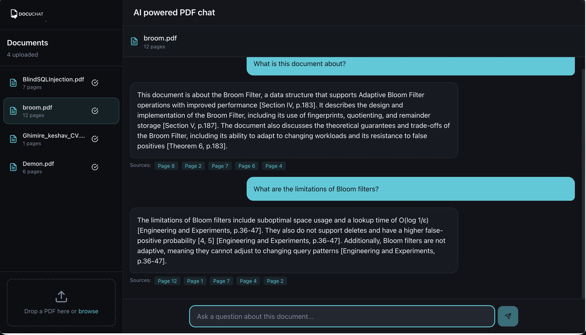

# DocuChat

A full-stack AI-powered PDF Question Answering system that allows you to upload PDF documents and chat with them using natural language queries. Built with FastAPI, React, LangChain, Groq, and MongoDB Atlas Vector Search.



## Features

- 📄 **PDF Upload & Processing**: Upload PDF documents and automatically extract, chunk, and embed content
- 💬 **AI-Powered Chat**: Ask questions about your documents using natural language
- 🔍 **Semantic Search**: Uses vector similarity search to find relevant content across documents
- 📚 **Multi-Document Support**: Manage and chat with multiple PDF documents
- 🎨 **Modern UI**: Beautiful, responsive React interface with dark mode support
- 📝 **Page Citations**: Answers include page references for easy verification

## Tech Stack

### Backend
- **Framework**: FastAPI
- **LLM**: Groq (LLaMA 3 / Mixtral) via `langchain-groq`
- **Embeddings**: Hugging Face `sentence-transformers` (all-MiniLM-L6-v2)
- **Vector DB**: MongoDB Atlas Vector Search (cosine similarity)
- **Orchestration**: LangChain
- **PDF Processing**: PyPDF

### Frontend
- **Framework**: React 18 with TypeScript
- **Build Tool**: Vite
- **UI Components**: Radix UI + Tailwind CSS
- **State Management**: TanStack Query (React Query)
- **Routing**: React Router

## Prerequisites

- Python 3.8+ (for backend)
- Node.js 18+ and npm (for frontend)
- MongoDB Atlas account with a cluster
- Groq API key ([Get one here](https://console.groq.com/))

## Installation & Setup

### 1. Clone the Repository

```bash
git clone <repository-url>
cd pdf
```

### 2. Backend Setup

#### Install Dependencies

```bash
cd backend
python -m venv .venv
source .venv/bin/activate  # On Windows: .venv\Scripts\activate
pip install -r requirements.txt
```

#### Configure Environment

```bash
cp env.example .env
```

Edit `.env` with your credentials:

```env
# Groq API Key
GROQ_API_KEY=your_groq_api_key

# MongoDB Atlas Connection String
MONGODB_URI=mongodb+srv://<user>:<pass>@<cluster>/<db>?retryWrites=true&w=majority

# Other settings (see backend/env.example for full list)
```

#### Setup MongoDB Atlas Vector Search Index

1. Create a Vector Search index on your MongoDB Atlas cluster
2. Use the configuration from `backend/mongodb_vector_index.json`
3. **Important**: 
   - Index name must match `MONGODB_VECTOR_INDEX_NAME` (default: `chunks_vector_index`)
   - Dimensions must match `EMBEDDINGS_DIMENSIONS` (default: `384`)

See `backend/README.md` for detailed MongoDB setup instructions.

### 3. Frontend Setup

```bash
# From project root
npm install
```

#### Configure API URL (Optional)

Create a `.env` file in the project root:

```env
VITE_API_BASE_URL=http://localhost:8080/api
```

Default is `http://localhost:8080/api` if not specified.

## Running the Application

### Start Backend Server

```bash
cd backend
source .venv/bin/activate  # On Windows: .venv\Scripts\activate
cd ..
python -m backend.main
```

Backend will start on `http://localhost:8080`

### Start Frontend Development Server

In a new terminal:

```bash
npm run dev
```

Frontend will start on `http://localhost:5173`

### Production Build

```bash
# Build frontend
npm run build

# Preview production build
npm run preview
```

## API Endpoints

### Document Management
- `GET /api/documents` - List all documents
- `POST /api/documents/upload` - Upload a PDF document
- `GET /api/documents/{documentId}` - Get document details
- `DELETE /api/documents/{documentId}` - Delete a document

### Chat
- `POST /api/chat/query` - Send a query about a specific document

See `backend/README.md` for complete API documentation.

## Project Structure

```
pdf/
├── backend/              # FastAPI backend
│   ├── api.py           # API routes
│   ├── main.py          # Application entry point
│   ├── loaders.py       # PDF loading
│   ├── chunking.py      # Text chunking
│   ├── embeddings.py    # Embedding generation
│   ├── vector_store.py  # MongoDB vector operations
│   ├── retriever.py     # RAG retrieval logic
│   ├── llm.py           # LLM integration
│   └── settings.py      # Configuration
├── src/                 # React frontend
│   ├── components/      # React components
│   ├── hooks/          # Custom React hooks
│   ├── pages/          # Page components
│   └── lib/            # Utilities
└── README.md           # This file
```

## Configuration

### Backend Environment Variables

Key settings in `backend/.env`:

- `GROQ_API_KEY`: Your Groq API key
- `GROQ_MODEL`: Model to use (default: `llama-3.1-70b-versatile`)
- `MONGODB_URI`: MongoDB Atlas connection string
- `EMBEDDINGS_DIMENSIONS`: Must match your vector index (default: `384`)
- `CHUNK_SIZE`: Text chunk size (default: `1000`)
- `TOP_K`: Number of chunks to retrieve (default: `6`)

See `backend/env.example` for all available options.

### Frontend Environment Variables

- `VITE_API_BASE_URL`: Backend API URL (default: `http://localhost:8080/api`)

## Notes

- **Page References**: Each chunk includes page metadata, and answers include citations like `Citations: file.pdf p.3`
- **Session Management**: Documents are scoped by `session_id` (default: `default`)
- **File Size Limit**: Default max upload is 50MB (configurable via `MAX_UPLOAD_MB`)

## Troubleshooting

### Backend Issues
- Ensure MongoDB Atlas Vector Search index is created correctly
- Verify `EMBEDDINGS_DIMENSIONS` matches your vector index dimensions
- Check that Groq API key is valid and has quota

### Frontend Issues
- Ensure backend is running on the correct port
- Check browser console for CORS errors
- Verify `VITE_API_BASE_URL` matches your backend URL

